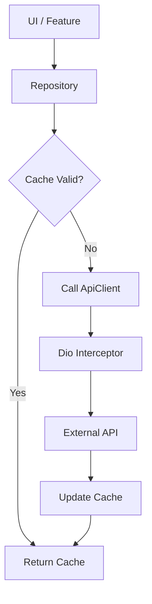

# API Entegrasyon Planı

## Hedef
Uygulamanın tüm ağ (network) işlemlerini merkezi, güvenli ve önbellekleme dostu bir yapıya kavuşturmak.

## Kullanılacak Teknoloji
- **Dio**: `http` yerine daha gelişmiş (interceptors, timeout, form-data, vs.) özellikleri için.

## Mimari Yapı
### 1. API Client
`lib/data/api_client.dart`:
- `Dio` instance yapılandırması.
- Interceptors (API anahtarları, Auth token'ları, hata yakalama).

### 2. Base Service/Repository
- Tüm servislerin `ApiClient` kullanmasını sağlamak.
- Önbellekleme mantığını (Cache-Aside) ortak bir `BaseRepository` ile yönetmek.

## Uygulama Adımları
- [ ] `pubspec.yaml` dosyasına `dio` ekle.
- [ ] `lib/data/api_client.dart` oluştur.
- [ ] Mevcut `cami_service.dart` gibi sınıfları `ApiClient` kullanacak şekilde refactor et.
- [ ] Önbellekleme mantığını (SQLite) `BaseRepository` ile merkezileştir.

## Akış Şeması (Mermaid)

