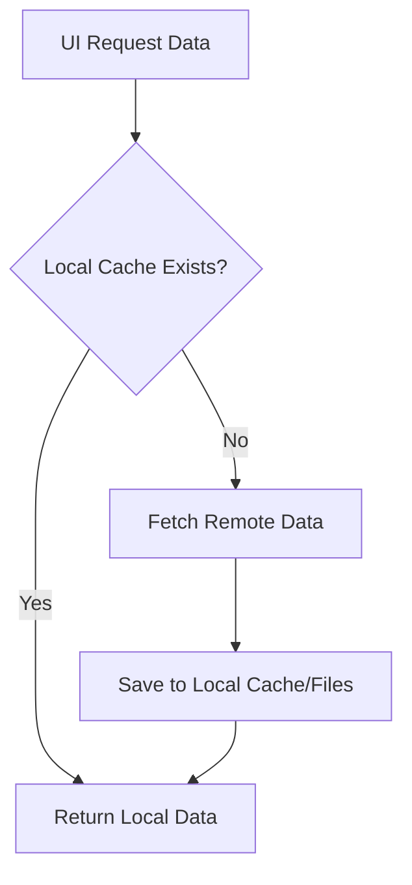

# Gelişmiş Çevrimdışı Önbellekleme Tasarımı

## Hedef
Ağ bağlantısı kısıtlı veya yokken Kuran ve Kütüphane içeriklerine akıcı erişim sağlamak.

## Teknoloji Seçimi
- **Sqflite**: Yapısal veriler (Kütüphane ağacı, Kuran sayfası meta verileri/dosya yolları, son okunan sayfası) için.
- **Local File Storage (path_provider)**: Büyük dosyalar (Kuran sayfa görselleri, ses dosyaları) için.

## Mimari
### Repository Pattern
Mevcut `Repository` sınıfları güncellenecek:
1. `fetchData()` çağrıldığında önce yerel veritabanı/dosya sistemi kontrol edilecek.
2. Yerel veri varsa (ve güncelse) döndürülecek.
3. Yerel veri yoksa veya eskiyse (cache-control/timestamp kontrolü), uzak API'den çekilecek, yerel veritabanına/dosya sistemine yazılacak ve kullanıcıya sunulacak.

## Veri Modelleri
### 1. LibraryContent
- ID, Title, ImagePath (yerel), Content (metin), ParentID, Type (book/chapter)

### 2. KuranPageMetadata
- PageNumber (PK), ImagePath (yerel), IsDownloaded, Cüz, SureName

## Akış Şeması (Mermaid)

