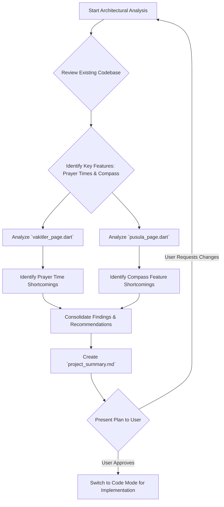

# Project Technical Summary: Ezan Vakti Uygulaması

This document provides a technical overview of the `ezan_app` Flutter project, assessing its adherence to Flutter standards and identifying key shortcomings in the prayer times and compass features.

## 1. Project Overview

The `ezan_vakti_uygulamasi` is a Flutter application designed to provide prayer times and a Qibla compass feature. It integrates with external APIs for data and utilizes various Flutter packages for core functionalities and UI.

### 1.1 File Structure (`lib/features`):
The project follows a modular structure, organizing features into separate directories under `lib/features`:
- `auth/`: Authentication services.
- `dini_gunler/`: Religious days feature.
- `hutbe/`: Sermons feature.
- `imsakiye/`: Imsakiye (fasting times) feature.
- `kuran/`: Quran-related features.
- `menu/`: Application menu.
- `pusula/`: Qibla compass functionality.
- `settings/`: User settings.
- `vakitler/`: Prayer times display and logic.
- `zikirmatik/`: Tasbih counter.

This organization promotes maintainability and separation of concerns.

### 1.2 `pubspec.yaml` Dependencies:
- **Core Functionality:** `http`, `geolocator`, `audioplayers`, `shared_preferences`, `flutter_local_notifications`, `timezone`, `permission_handler`, `flutter_compass`, `intl`, `scrollable_positioned_list`.
- **Firebase Integration:** `firebase_core`, `firebase_auth`, `cloud_firestore`, `google_sign_in`.
- **State Management:** `provider`.
- **Mapping:** `google_maps_flutter`.
- **UI/Content:** `html`, `syncfusion_flutter_pdfviewer`.
- **Environment Variables:** `flutter_dotenv` (indicates an intention for secure key management).

## 2. Prayer Times Feature (`lib/features/vakitler/vakitler_page.dart`)

### 2.1 Technical Summary:
- Fetches prayer times and local weather data from `aladhan.com` and `openweathermap.org` APIs, respectively.
- Updates prayer times based on selected city and calculation method (managed by `AuthService`).
- Uses a `Timer` to dynamically update a countdown to the next prayer and a progress indicator.
- Supports multiple highly customizable UI layouts (Circular, Analog Clock, Photographic, Timeline, Dashboard, List).
- Includes a `CitySearchPage` for users to select a city from a hardcoded list of Turkish cities.
- Manages text localization via `authService.translate`.

### 2.2 Shortcomings:
1.  **API Key Management:** The `myApiKey` for OpenWeatherMap is directly referenced without clear indication of being loaded from `flutter_dotenv` in `vakitler_page.dart`. This is a security risk if hardcoded.
2.  **Limited Real-time Location for Prayer Times:** Prayer times are based on a user-selected city. There's no mechanism for automatically updating prayer times based on the device's real-time GPS location changes, which could lead to inaccuracies if the user travels.
3.  **Basic API Error Feedback:** API call failures primarily result in `_isLoading` being set to `false`, without providing specific user-friendly error messages (e.g., "Network error", "City not found").
4.  **Date Handling for Prayer Times:** The current implementation might be limited to calculating times for the current day and the next Fajr. A more robust solution would fetch and manage prayer times for several days in advance, handling date transitions explicitly and supporting offline access.
5.  **Hardcoded Initial Vakit Times:** The `vakitler` list is initialized with placeholder values (e.g., `"05:00"`). While these are overwritten by API data, it's a minor inefficiency.

## 3. Compass Feature (`lib/features/pusula/pusula_page.dart`)

### 3.1 Technical Summary:
- Utilizes `flutter_compass` for device heading and `geolocator` for current location.
- Calculates the Qibla angle (`_qiblaAngle`) using the user's coordinates and fixed Kaaba coordinates.
- Displays a visually appealing compass UI with an animated rotation that responds to device orientation.
- Provides a visual indicator (`isAligned`) when the compass is pointing towards the Qibla.
- Includes a `QiblaMapPage` (using `google_maps_flutter`) to visualize the user's location, Kaaba, and the Qibla direction on a map.
- Handles location permission requests and basic error scenarios.

### 3.2 Shortcomings:
1.  **Limited User Feedback for Location Errors:** Error messages related to location services being disabled or permissions denied are primarily logged to `debugPrint`. The user interface only shows a generic "Konum alınıyor, lütfen bekleyin..." (`QiblaMapPage`) for location retrieval, which is not specific enough when errors occur.
2.  **No Fallback for Compass Data:** If `flutter_compass` does not provide heading data (e.g., on emulators or devices without a magnetometer), the compass remains in a loading state indefinitely without informing the user.
3.  **Initial `_qiblaAngle` Value:** `_qiblaAngle` is initialized to a fixed `147` degrees, which could cause a momentary incorrect display before the actual calculation occurs.
4.  **Static User Position in Map:** `QiblaMapPage` initializes `_userLocation` once. If the user's physical location changes while viewing the map, the map will not automatically update to reflect the new position.

## 4. General Flutter Standards Adherence & Recommendations

### 4.1 Adherence to Standards:
- **Modular Codebase:** Good use of `lib/features` for organizing different application modules.
- **State Management:** `provider` is used for `AuthService`, demonstrating an understanding of state management patterns.
- **UI/UX Focus:** Multiple UI themes for prayer times show an emphasis on user experience and customization.
- **Resource Management:** `Timer` and `StreamSubscription` are correctly disposed of in `initState` and `dispose`.

### 4.2 Recommendations for Improvement:
1.  **Centralized Configuration:** Implement `flutter_dotenv` fully for all API keys and sensitive configurations to enhance security and ease of management.
2.  **Comprehensive Internationalization:** Ensure all user-facing strings are managed through the `intl` package or a similar i18n solution, using keys rather than raw strings, even for `authService.translate` calls.
3.  **UI Consistency and Maintainability:** Extract "magic numbers" (hardcoded sizes, colors, paddings) into theme data, constants, or dedicated style files for easier maintenance and consistent theming.
4.  **Enhanced Error Reporting:** Provide more specific and actionable error messages to the user for network issues, API failures, and location service problems.
5.  **Robust Prayer Time Logic:** Consider using a battle-tested prayer time calculation library directly if `aladhan.com`'s API is not sufficient for future needs or if offline calculation is desired. Implement a caching mechanism for prayer times.
6.  **User-centric Location Handling:** Implement clearer UI feedback and guidance when location services are required but unavailable or denied, offering users options to enable them.
7.  **Automated Testing:** Introduce unit and widget tests for critical logic (prayer time calculations, Qibla calculations) and key UI components to ensure reliability and facilitate future development.
8.  **Asset Management:** Ensure all assets used (e.g., `ezan.mp3`, `uyari.mp3.mp3`) are explicitly listed in `pubspec.yaml` under the `assets` section to avoid runtime issues.

## Proposed Plan

## Next Steps (Todo List)

- [x] Analyze `pubspec.yaml` for dependencies and project metadata
- [x] Create a `plans/project_summary.md` file with the technical overview, Flutter standards adherence, and shortcomings of prayer times and compass features
- [ ] Discuss the proposed plan with the user and get approval
- [ ] Switch to `code` mode to implement the approved changes