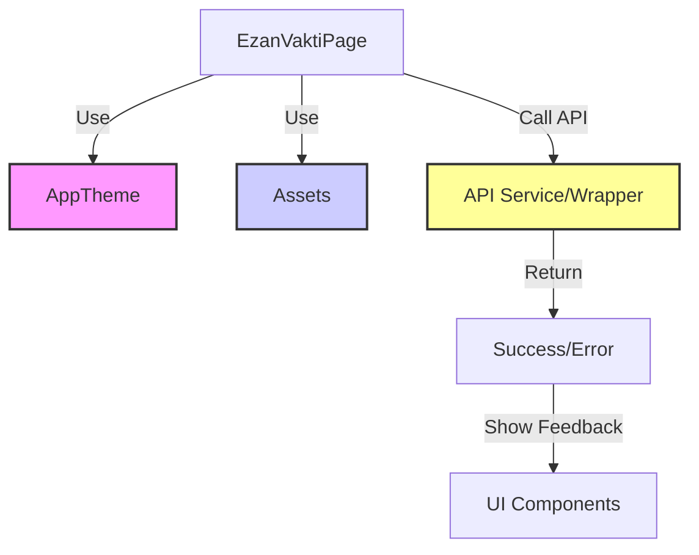

# Refactoring Plan

## 1. AppTheme Integration
- Identify all hardcoded colors in `lib/features/vakitler/vakitler_page.dart`.
- Replace hardcoded colors with `AppTheme` helpers.

## 2. Asset Path Updates
- Update `vakitler` list in `lib/features/vakitler/vakitler_page.dart` to use `Assets` constants.
- Ensure all widgets using these assets correctly handle the paths.

## 3. API Error Handling
- Refactor `_fetchData` in `lib/features/vakitler/vakitler_page.dart` to use a more robust error handling mechanism.
- Add specific error messages for different types of failures (network, server, etc.).

## Workflow

